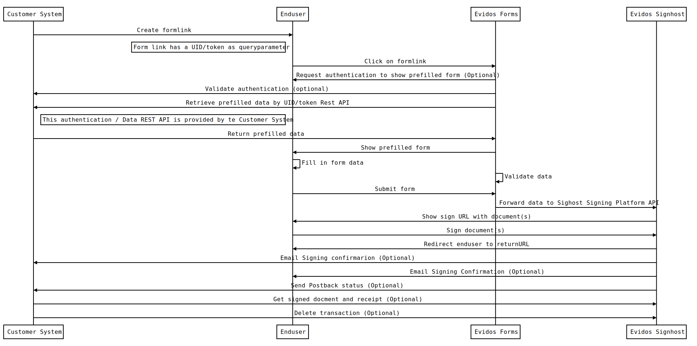

Evidos makes it possible to provide webforms to your customers to fill and sign transactions in one integrated flow.
In this way, you have a flexible solution to collect data in a smart way and generate the documents to be signed based on a template.
In general, it is not possible to fill any smart formfields during the Evidos Signhost signing process, Evidos Forms is a specialized module to offer this functionality.

It is also possible to offer a prefilled form based on the data that you already have available in your own customer system.
This makes it possible that the enduser is not required to fill all data all over again.

The following technical documentation describes the way how you can integrate your application with Evidos Forms.

## Before you start
All connections are done using JSON Rest webservices over an https connection;

The architectural principle is to store a minimum of personal data for the shortest time as possible at the Evidos platform.
Only for the time needed to process the transaction;

If the forms are prefilled with customer data, this data is not stored on the Evidos platform.
When the enduser clicks on the webform URL the customer data is retrieved;

Retrieving customer data is based on a pull principle.
Evidos forms gets the data using an integration with the customer system.
Preferable a JSON/REST webservice;

Evidos has several standard REST API integrations available for common customer systems like Salesforce to retrieve the customer data;

Detailed mapping of the REST API and data forms is dependent on the design of the form and required data fields.
They follow the same implementation principles as described below.

## Sequence diagram
The integration of Evidos Forms makes use of the following components;
 - **Enduser**; Enduser using a (mobile) browser to fill in the form and sign the contract(s)
 - **Evidos Forms**; The module that provides the webform and optionally retrieves the data from the customer system
 - **Customer system**; The system of the customer where enduser data is available, retrieved and signed contracts are stored.
 - **Evidos Signhost**; The Evidos signing platform to sign the documents.

The following sequence diagram shows an example of the process flow of the webform signing integration

**Evidos Forms Signhost integration**

